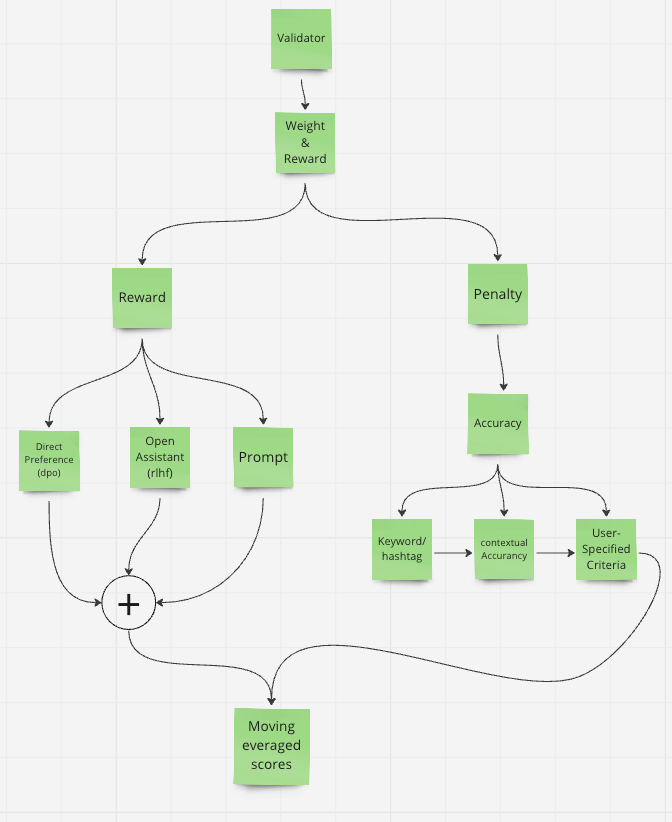

# Twitter Scraper Miner and Validator on Bittensor Network

## Miner

### Process Overview
1. **Analyze Query**: Extract query criteria for Twitter API including keywords, hashtags, and user mentions. This aids in verifying the accuracy of responses.

    ```python
    async def analyze_twitter_query(query):
        """
        Analyze the user query using OpenAI's API to extract relevant criteria.
        """
        content = f"""
        Given the topic '{query}', perform the following tasks in JSON format:
        1. Construct a Twitter query string.
        2. List key keywords central to this query.
        3. Determine relevant hashtags.
        4. Identify significant user mentions.
        """
        messages = [{'role': 'user', 'content': content }]
        res = await call_openai(messages, 0.85, "gpt-4-1106-preview", 12,  {"type": "json_object"})
        response_dict = json.loads(res)
        return TwitterQueryResult(response_dict)
    ```

2. **Fetch Tweets**: Currently uses mock data (`dataset_twitter.json`) for testing purposes. Integration with the Twitter API is planned.

3. **Generate User Response**: OpenAI is used to create a summary based on user requirements and the fetched tweets.

    ```python
    twitter_query: TwitterQueryResult = await analyze_twitter_query(prompt)
    filtered_tweets = await mock_filter_tweets(twitter_query.api_params)
    content = f"""
    User question: '{prompt}',
    Tweet data: '{filtered_tweets}'
    Generate an appropriate response based on this data.
    """
    messages = [{'role': 'user', 'content': content}]
    response = await client.chat.completions.create(
        model= model,
        messages= messages,
        temperature= 0.0001,
        stream= True,
        seed=seed,
    )
    ```

4. **Validator**: The response from OpenAI API is sent to the Validator for evaluation.

## Validator

### Workflow
1. **Initialization**: Executes the prompt for available Miner UIDs. Example prompts are in `twitter_validator.py`.

2. **Query Analysis**: Similar to the Miner process, it generates a query string for the Twitter API, including keywords, hashtags, and user mentions.

3. **Scoring System**: Rewards are assigned based on the responses from miners.

    

### Reward Functions
These functions output floating point numbers, added together to form a cumulative score.

```python
self.reward_functions = [
    OpenAssistantRewardModel(device=self.device) if self.config.reward.rlhf_weight > 0 else MockRewardModel(RewardModelType.rlhf.value),  
    PromptRewardModel(device=self.device) if self.config.reward.prompt_based_weight > 0 else MockRewardModel(RewardModelType.prompt.value),
    DirectPreferenceRewardModel(device=self.device) if self.config.reward.dpo_weight > 0 else MockRewardModel(RewardModelType.prompt.value),                
]
```

1. **OpenAssistantReward**: Judges the quality of an answer given a question. More details: [OpenAssistant Reward Model](https://huggingface.co/OpenAssistant/reward-model-deberta-v3-large-v2)

2. **PromptReward**: Scores the relevance and insightfulness of a question given a context. Requires additional model download.

3. **DirectPreferenceRewardModel**: Optimizes rewards based on a reference model's log-probability for completion tokens. More details: [Direct Preference Optimization](https://huggingface.co/cerebras/btlm-3b-8k-base)

### Penalty Functions
These functions output floating point numbers, which are multiplied with the response.

```python
self.penalty_functions = [
    TaskValidationPenaltyModel(max_penalty=0.6),
    AccuracyPenaltyModel(max_penalty=1),
]
```

1. **AccuracyPenaltyModel**: Calculates penalties based on the match between completions and the expected query criteria.


### Final Step: Logging Results
```python
bt.logging.info(f"Scattered reward: {torch.mean(scattered_rewards)}")
bt.logging.info(f"Moving averaged scores: {torch.mean(self.moving_averaged_scores)}")
bt.logging.info(f"Best Response: {event['best']}")
```


### Notes
- The approach is inspired by Bittensor's official code ([Text Prompting](https://github.com/opentensor/text-prompting)) and documentation ([Bittensor Documentation](https://docs.bittensor.com/subnets/code-walkthrough-text-prompting)).
- Suitable for Twitter scraper applications.
- Future improvements include direct Twitter API integration, enhanced testing, and additional reward models for data validation (e.g., Timestamp Analysis, Original Content Verification, Data Corruption Checks).
- Refactor some part of the code
- Need to discuss logic for storing tweet data to save costs or always directly use the APIFY API
